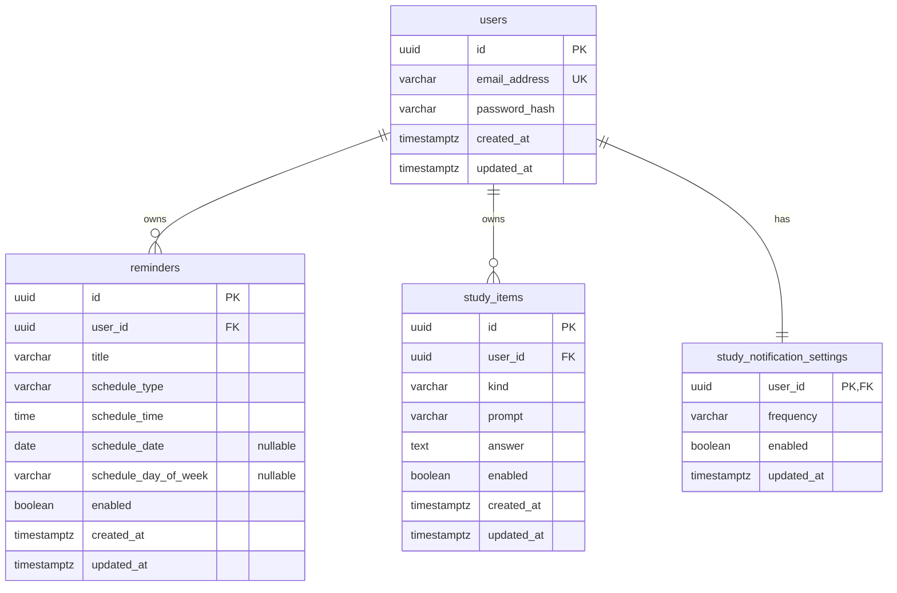

# リマインダーアプリ DB 設計書（ドラフト v0.1）

---

## 1. 設計方針

- ドメインの集約に対応する4つの永続化対象: `users` / `reminders` / `study_items` / `study_notification_settings`。
- 主キーは **UUID のサロゲートキー(意味を持たない、人工的な代理キー)**。
- 所有関係は `user_id` 外部キーで表し、ユーザー削除時は配下を **ON DELETE CASCADE** で関連データごと削除。
- 物理スキーマは「永続化モデル」であり、ドメインモデルとは分離する。両者の変換は実装側の責務とする。

### 1.1 意図的に持たないもの（責務境界）
要件で通知・選出が端末側の責務に確定したため、以下は **持たない**。
- 「次回発火時刻」列（規則から端末が算出）
- 通知履歴・通知ジョブ・選出履歴のテーブル
- リマインダーの元の自然言語文（要件 Q12: 保持しない）
- 学習通知の時間帯（9–21 時固定の定数。列にしない）

---

## 2. ER 図

---

## 3. 型の方針

### 3.1 時刻・日付の型（使い分けが肝）
| 用途 | 型 | 理由 |
|---|---|--|
| 監査時刻（`created_at`/`updated_at`） | `timestamptz` | 絶対時刻（瞬間）。タイムゾーンを正しく扱う |
| スケジュールの時刻（時・分） | `time`（タイムゾーンなし） | JST の壁時計時刻。瞬間ではなく「毎日 9:00」のような時刻 |
| 一回限りの日付 | `date` | 日付のみ |
| 曜日 | `varchar`（`MONDAY`〜`SUNDAY`） |  |

- 列挙値（`schedule_type` / `kind` / `frequency` / `schedule_day_of_week`）は **`varchar` + CHECK 制約** を基本とする。。

---

## 4. テーブル定義

### 4.1 users
| 列 | 型            | 制約 | 備考 |
|---|--------------|---|---|
| id | uuid         | PK | |
| email_address | varchar(254) | NOT NULL, UNIQUE | メール形式を検証。大文字小文字を区別しない |
| password_hash | varchar(255) | NOT NULL | bcrypt（60文字固定長）を採用 |
| created_at | timestamptz  | NOT NULL | |
| updated_at | timestamptz  | NOT NULL | |

インデックス: `email_address` の UNIQUE インデックス（ログイン検索）。

### 4.2 reminders
| 列                     | 型 | 制約 | 備考               |
|-----------------------|---|---|------------------|
| id                    | uuid | PK |                  |
| user_id               | uuid | NOT NULL, FK→users(id) ON DELETE CASCADE | 所有者              |
| title                 | varchar(100) | NOT NULL | ドメインの最大長 100 に対応 |
| schedule_type         | varchar(10) | NOT NULL, CHECK ∈ {ONE_TIME, DAILY, WEEKLY, MONTHLY} | 判別子              |
| schedule_time         | time | NOT NULL | 4種すべてが持つ時刻       |
| schedule_date         | date | NULL | ONE_TIME のみ使用    |
| schedule_day_of_week  | varchar(9) | NULL, CHECK ∈ {MONDAY…SUNDAY} | WEEKLY のみ使用      |
| schedule_day_of_month | smallint | NULL, CHECK 1–31 | MONTHLY のみ使用      |
| enabled               | boolean | NOT NULL, DEFAULT true | 有効/無効            |
| created_at            | timestamptz | NOT NULL |                  |
| updated_at            | timestamptz | NOT NULL |                  |

#### 4.2.1 スケジュール直和型の表現（本設計の中心）
`Schedule` の4バリアントを **単一テーブル＋判別子＋可変列（nullable）＋CHECK 制約** で表現する。各 type で「使う列／使わない列」を CHECK で強制する。

| schedule_type | schedule_time | schedule_date | schedule_day_of_week | schedule_day_of_month |
|---------------|---|---|----------------------|-----------------------|
| ONE_TIME      | 必須 | **必須** | NULL                 | NULL                  |
| DAILY         | 必須 | NULL | NULL                 | NULL                  |
| WEEKLY        | 必須 | NULL | **必須**               | NULL                  |
| MONTHLY       | 必須 | NULL | NULL                 | **必須**                |

- 上表を満たすことを保証する CHECK 制約を1つ設ける（type ごとに該当列の NOT NULL／NULL を要求）。
インデックス: `user_id`（所有者一覧）、`(user_id, enabled)`（端末同期で有効分の取得）。

### 4.3 study_items
| 列 | 型 | 制約 | 備考       |
|---|---|---|----------|
| id | uuid | PK |          |
| user_id | uuid | NOT NULL, FK→users(id) ON DELETE CASCADE | 所有者      |
| kind | varchar(4) | NOT NULL, CHECK ∈ {QA, TERM} | 形式種別     |
| prompt | varchar(500) | NOT NULL | 表（質問・単語） |
| answer | text | NOT NULL | 裏（回答・詳細） |
| enabled | boolean | NOT NULL, DEFAULT true | 有効/無効    |
| created_at | timestamptz | NOT NULL |          |
| updated_at | timestamptz | NOT NULL |          |

- `QA` と `TERM` は構造が同一（表/裏の2要素）なので、別テーブルにせず `kind` で区別する。
- インデックス: `user_id`、`(user_id, enabled)`。

### 4.4 study_notification_settings
| 列 | 型 | 制約 | 備考 |
|---|---|---|---|
| user_id | uuid | **PK**, FK→users(id) ON DELETE CASCADE | 主キー＝外部キー。1ユーザー1件を保証 |
| frequency | varchar(11) | NOT NULL, CHECK ∈ {ONCE, THREE_TIMES, FIVE_TIMES} | 1日あたりの回数 |
| enabled | boolean | NOT NULL, DEFAULT true | 機能のオンオフ |
| updated_at | timestamptz | NOT NULL | |

- `user_id` を主キーにすることで「1ユーザー1設定」を構造的に強制する。
- 時間帯（9–21 時）は固定定数のため列に持たない。
- 登録時に既定値で作成

### 4.5 reminder_intake_sessions
- 失効前提のため、**DB テーブルではなくキャッシュ（インメモリ）で保持する。

---

## 5. リレーション・整合性

| 関係 | 多重度 | 削除時 |
|---|---|---|
| users → reminders | 1 対 多 | CASCADE |
| users → study_items | 1 対 多 | CASCADE |
| users → study_notification_settings | 1 対 1 | CASCADE |

- 削除は物理削除（ハードデリート）を前提とする。
- 認可（本人のデータのみ）はアプリケーション層で `user_id` を突き合わせて担保する。

---

## 6. インデックス方針（まとめ）

| テーブル | インデックス                       | 目的 |
|---|------------------------------|---|
| users | UNIQUE(email_address)         | ログイン検索・重複防止 |
| reminders | (user_id), (user_id, enabled) | 所有者一覧・有効分取得 |
| reminders |   |  |
| study_items | (user_id), (user_id, enabled) | 同上 |

---

## 改訂履歴
| 版 | 日付 | 内容 |
|---|---|---|
| v0.1 | (ドラフト) | 初版ドラフト作成 |